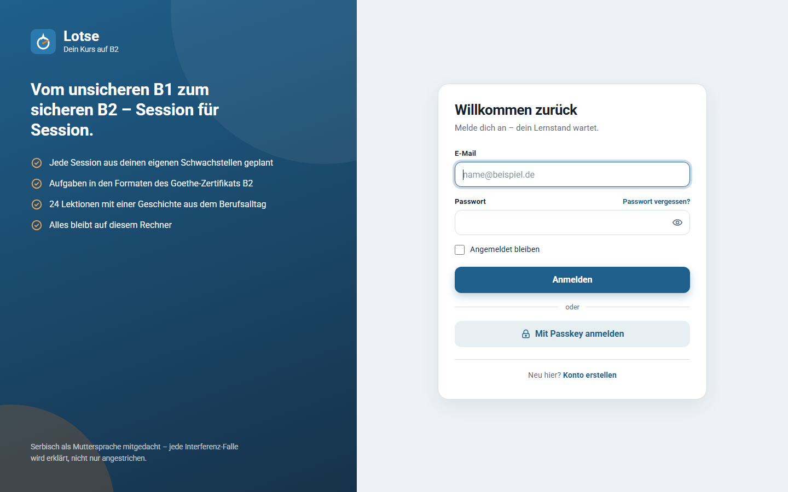
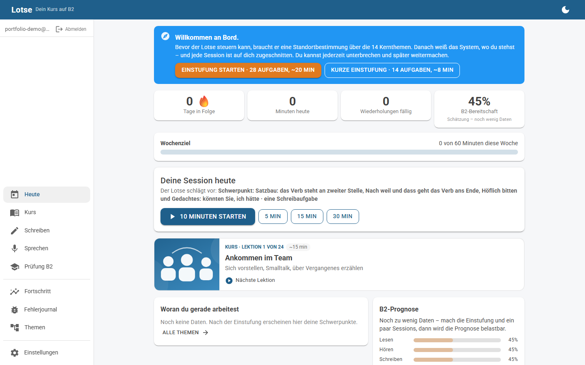
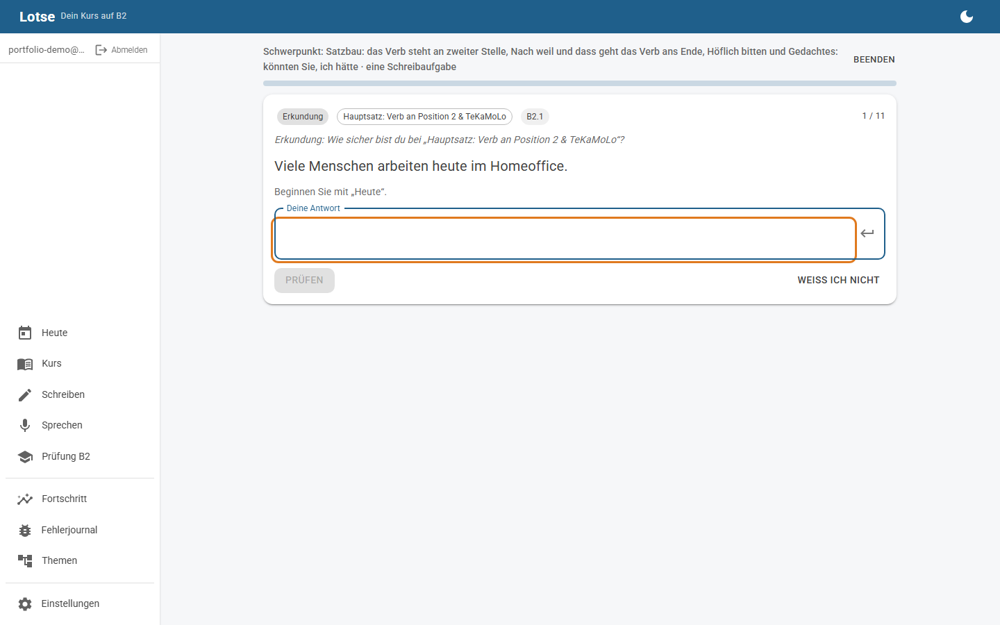

# Lotse – adaptive German coach for a real B2

**Lotse** (German for a harbour pilot) is a personal, adaptive German-learning application built to get one specific learner – a Serbian-speaking software developer living in Germany – from an uneven B1–B2 to a solid, exam-ready B2 (Goethe-Zertifikat B2 format; telc B2 transfers).

It is not a course. It is a closed loop: every answer updates a per-topic ability model, every mistake is tagged with an error code, and a planner composes each day's 5–30-minute session from due repetitions, targeted drills on the weakest topics, one production task (writing or speaking) and scheduled re-checks of topics that used to be weak.

> Concept and methodology: [docs/KONZEPT.md](docs/KONZEPT.md) · Roadmap: [docs/PLAN.md](docs/PLAN.md) · Architecture: [docs/ARCHITEKTUR.md](docs/ARCHITEKTUR.md)
> User guide (Serbian): [docs/UPUTSTVO.md](docs/UPUTSTVO.md) · Publishing on GitHub: [docs/GITHUB.md](docs/GITHUB.md) · Claude Chat tutor prompt: [docs/CLAUDE_CHAT_PROMPT.md](docs/CLAUDE_CHAT_PROMPT.md)

## Highlights

- **A course with a story.** 24 lessons in two parts follow two years at a Bremen software company. Part 1: the first day in the team, the first formal mail to the boss, a stand-up, an angry customer, the Bürgeramt, the flat and the neighbours, the doctor, a production incident, the home-office debate, weekend small talk, the salary talk, exam day. Part 2: mentoring a new colleague, a Kita parents' evening, organising the company outing, presenting to the customer, a team conflict, an evening course at the VHS, disputing the utility bill, rumours of a merger, an internal application, listening to the news, and the two exam days (Lesen, Schreiben). Each lesson opens with an interactive dialogue in which you choose your own lines and every option is explained, continues with a grammar focus explained through German↔Serbian (or German↔English) example pairs, each one speakable, and ends with a writing or speaking task.
- **Interactive exercise types.** Dialogues, spot-the-error (tap the wrong word in a colleague's message), pair matching, gap fill, transformation, translation, word order, vocabulary with article, dictation, free writing, speaking.
- **Skill map underneath.** 62 skill nodes (grammar, vocabulary, Redemittel, reading, listening, writing, speaking) on CEFR sub-bands, three of them above B2; 57 error codes; contrastive Serbian↔German notes on every interference-prone topic.
- **Adaptive engine, fully deterministic and unit-tested.** Rasch/Elo-style ability per node, SM-2-family spaced repetition with behaviour-derived grades, weak-area analysis with trends, a session planner that explains every choice, a 7/21/60-day re-check cycle for recovered weaknesses, exam readiness per module.
- **Production first.** Typed gap fills, transformations, Serbian→German translation, word order, vocabulary with article, dictation, daily free writing/speaking. Tolerant checking (umlauts, ß, one typo, capitalisation, missing article) that still logs every slip.
- **Works without any API key.** 2,251 exercises (1,041 vocabulary items with article, plural, example and a gloss in your bridge language), rule-based feedback on free writing, self-check rubrics with model answers, local neural speech.
- **Two bridge languages, one target language.** The interface, the tasks and the feedback are German throughout - that is the point. Serbian or English only carries the vocabulary prompts, the translation sources, the second column of the grammar tables and the contrastive notes, switchable per account. The notes are written for each first language rather than translated: what trips up a Serbian speaker (articles, verb-second) and an English one (cases, verb-final clauses) is not the same list.
- **B2 or C1 as the declared goal.** One setting moves one thing: how far above B2 the planner's focus may reach. A C1 learner gets the three C1 nodes - elevated vocabulary, the connectors that mark a C1 text (zumal, sofern, ungeachtet, geschweige denn) and the fixed phrases you cannot build word by word - plus the B2.2 grammar in their daily focus, and a "C1-Nähe" figure on Heute; a B2 learner never does. The placement, the difficulty targeting and the exam pages stay B2 - and the exam page says so, because an app without a C1 blueprint should not imply it has one.
- **Your field, as a nudge and nothing more.** Pick a Branche (IT, care, construction, medicine, office, retail, electrical engineering) and matching vocabulary nodes get a small priority boost while equally suitable exercises break ties in its favour - and the session says so when it mattered ("Vorgezogen, weil du in der Pflege arbeitest"). Weaknesses still decide what is practised; the field never hides material.
- **The course knows your name.** Lesson dialogues and model answers carry `{Vorname}` / `{Nachname}` / `{Name}` tokens instead of the author's name; the profile fills them in at the moment content is handed to one learner, so the shared exercise bank stays neutral and no name leaks between accounts on the same machine.
- **Progress you can act on, not points.** A weekly goal in minutes, a Monday review of the week that ended, and three cards built from the spaced-repetition state: how many items have stuck (stability past three weeks), how much falls due over the next seven days, and what share of the scheduled material you would get right this minute. No XP, no badges, no leaderboard.
- **Readiness with a direction.** The exam-readiness number keeps a daily snapshot and shows its change against roughly a week ago - or says nothing at all until there is something to compare with.
- **Measured grammar coverage.** A 51-item reference inventory of B2 grammar (`tools/b2-grammar-reference.json`, compiled from Profile Deutsch, the common ground of the standard B2 textbooks, and the Goethe rating criteria) is scored against the content by `tools/grammar-coverage.py`; every *Muss* item now reaches the top grade, every writing and speaking task demands a named structure in its rubric, and tests keep both from falling back. Report: [docs/GRAMMATIK_ABDECKUNG.md](docs/GRAMMATIK_ABDECKUNG.md).
- **FSRS-5 spaced repetition.** The scheduler Anki ships by default: every item has a memory stability and a difficulty, comes due when its recall probability drops to 90 %, and a lapse shrinks stability instead of resetting it. Grades come from behaviour (wrong / slip / hint / speed), never from self-rating.
- **Real feedback on free writing without any key.** A rule-based analyzer built for what a Serbian speaker's German actually trips over - haben/sein in the perfect, verb position after *weil/dass* and fronted adverbials, the missing comma, ä/ö/ü/ß, case after prepositions (gender from the vocabulary bank), n-declension, verb + preposition, formal register - tags every finding with a catalogue code so it feeds the journal and the learner model. Precision over recall: a clean B2 text produces nothing.
- **Tested by ten simulated learners.** A nurse on her phone, a keyboard-only user, a DaF examiner, a 19-year-old on TikTok time - each a scripted Playwright persona with its own account and a brief to be honest. Their report (`docs/NUTZERTEST_2026-09.md`) became the 0.8.0 backlog; `tools/persona-harness` re-checks every finding against the running app.
- **Separate accounts, own login, passkeys.** Register/log in (ASP.NET Core Identity, cookie auth, lockout, encrypted-at-rest API key) and everything - skill state, sessions, error journal, Tutor settings - is scoped to that account alone; a second account starts from a blank slate and can never see the first one's data or spend its API key. Every page requires sign-in by default (fallback authorization policy), with the login/registration pages the one deliberate exception. Passkeys (WebAuthn - fingerprint, face, device PIN) work alongside the password, end-to-end tested with Chromium's virtual authenticator.
- **AI tutor (optional), provider-agnostic, configured in the app.** Rubric-based evaluation of writing and speaking with tagged errors that feed the model, on-demand exercise and reading/listening generation, a discussion partner for the oral exam. Pick a provider on the settings page: Groq (free, fast, the default suggestion), Claude via the official Anthropic SDK, OpenRouter, Ollama or LM Studio locally, Mistral, DeepSeek, OpenAI or any OpenAI-compatible server. Connection test, encrypted key storage (ASP.NET Data Protection), switch at runtime, graceful fallback from `json_schema` to `json_object` to plain text, retries with backoff. The time budget per answer follows the provider: hosted models get 120 s, local ones 300 s, because a 7B on a desktop GPU needs one to three minutes for a full evaluation - measured, not guessed.
- **Self-diagnosis and self-repair.** Health panel (content, database integrity, tutor) with one-click repair, `/health` endpoint, error boundary with friendly recovery, provider errors translated into actionable sentences.
- **Mobile-first details.** Bottom navigation on phones, installable PWA, system dark mode, keyboard shortcuts on desktop (Enter, digits) hidden on touch.
- **Exam realism.** Goethe B2 blueprint as data, writing/speaking tasks in exact exam formats, reading and audio-only listening tasks in exam part formats, readiness report against the 60 % rule.

## Screens

| Login | Heute | Session |
|---|---|---|
|  |  |  |
| Own account per learner (ASP.NET Core Identity, passkeys supported). | Streak, minutes, due reviews, readiness; one button starts the planned session; weak areas and exam prognosis. | One item per step with topic and CEFR tags, immediate feedback with explanation and Serbian contrast. |

Also: *Kurs* (24 story-driven lessons), *Schreiben* (micro tasks, exam Teil 1/2), *Sprechen* (spontaneous, Vortrag, discussion with AI partner), *Prüfung B2* (blueprint + simulations), *Fortschritt*, *Fehlerjournal*, *Themen* (focus sessions, generate exercises), *Einstellungen*, *Konto* (register/log in/change password - every other page requires being signed in).

## Quick start

Requirements: .NET 10 SDK **10.0.300 or newer** (`global.json` pins the 10.0.3xx feature band - `dotnet --list-sdks` must show one; a 10.0.1xx from an older installer will not do). Chrome or Edge for speech recognition (any browser for the rest).

```bash
git clone https://github.com/aco993/Lotse.git && cd Lotse
dotnet run --project src/Lotse.Web
```

Open http://localhost:5178 (or the port printed in the console), register an account (no email confirmation required - registration signs you in right away), and you're at the dashboard. Data lives in `src/Lotse.Web/data/lotse.db` (SQLite, created on first start).

No mail server is configured on a fresh clone, so "Passwort vergessen?" logs the reset link to the console instead of emailing it - watch the terminal Lotse is running in after requesting one.

### Better pronunciation (optional, recommended)

Out of the box, listening tasks use the browser's own German voices. On Windows those are the older Hedda/Katja/Stefan
voices and they sound noticeably robotic. One command replaces them with a neural voice that runs locally:

```powershell
powershell -ExecutionPolicy Bypass -File tools/install-piper.ps1
```

Windows PowerShell 5.1 is enough - the script was written for it - so nothing needs installing first. (If you downloaded the repository as a ZIP rather than cloning it, run `Get-ChildItem -Recurse tools\*.ps1 | Unblock-File` once: Windows marks extracted files as web content and refuses to run them.) The step is Windows-only for now; on macOS and Linux the browser voices stay in use, or install Piper yourself and point `Lotse:Tts:PiperPath` at it.

It downloads Piper (MIT, ~21 MB) and two German voices (CC0, ~120 MB together) into `%LOCALAPPDATA%\Lotse`:
`de_DE-thorsten-medium` as the default and male voice, `de_DE-kerstin-low` for the women in the story - so Herr Krüger
and Sabine no longer sound like the same person. Nothing goes into the repo, no API key, and no sentence ever leaves
the machine; a line renders in about half a second and is then cached.

Lotse picks the voices up automatically and logs `Lokale Sprachausgabe aktiv: ...` at startup. Without the step the
browser voices simply stay in use, and with only the default voice installed every role speaks with it. Rendered audio
is cached under the data directory and served only to a signed-in learner. The script is idempotent - re-running it
skips what is already there, which is also how you add the second voice later.

### Optional: enable the AI tutor

Open **Einstellungen → KI-Tutor**, pick a provider, paste a key, press *Verbindung testen*, then *Speichern & aktivieren*. The key is stored encrypted on this machine only. Groq offers a free tier (https://console.groq.com/keys) and answers in seconds; Claude gives the best exam-grade feedback; Ollama runs fully offline.

**Running Ollama? Give the model a bigger context first.** Ollama's default of 4096 tokens is not enough for a whole evaluation: the same request that produced valid JSON in 117 seconds with `num_ctx 8192` ran for ten minutes and returned nothing at the default. The JSON schema is not the problem (122 s with it, 139 s without) - the context is. Create a derived model once; it is a config layer over the same weights and costs no extra disk:

```powershell
ollama pull qwen2.5:7b
"FROM qwen2.5:7b`nPARAMETER num_ctx 8192" | Out-File -Encoding ascii Modelfile
ollama create qwen2.5-lotse -f Modelfile
```

(On macOS/Linux: `printf 'FROM qwen2.5:7b\nPARAMETER num_ctx 8192\n' > Modelfile` for the second line.)

Then enter `qwen2.5-lotse` as the model and leave the time limit at the preset's 300 s.

Keys can also come from environment variables (`GROQ_API_KEY`, `ANTHROPIC_API_KEY`, `OPENROUTER_API_KEY`, `OPENAI_API_KEY`, …) or from configuration defaults in `appsettings.json` → `Lotse:Tutor` (`Preset`, `Model`, `BaseUrl`). See `appsettings.Ollama.json` and [docs/UPUTSTVO.md](docs/UPUTSTVO.md) §6 for a provider comparison. Without a tutor every feature except AI evaluation, generation and the discussion partner is available.

### Tests

```bash
dotnet test tests/Lotse.Core.Tests tests/Lotse.Web.Tests
```

No browser needed for these. (A bare `dotnet test` at the root also runs the Playwright suite below, which is red until Chromium has been downloaded once - do that step first if you want everything in one go.)

255 tests (186 engine/content/service, 69 component/host): lesson and dialogue integrity, grammar coverage and production pressure against the B2 reference inventory, engine (ability updates, answer checking, scheduler, re-check lifecycle, planner behaviour), content integrity (every exercise valid, every core node covered below and above the B1/B2 boundary, every seed answer accepted by the checker), application service against a temporary SQLite database, migrations vs. model drift, the OpenAI-compatible provider against a scripted HTTP handler (schema fallback, retries, error mapping), tutor settings persistence and encryption, multi-user isolation (two accounts, neither can see the other's skill state, sessions or Tutor API key; a reset empties every table for one account and none for the other), the open-redirect guard and the German Identity messages, bUnit component tests for the exercise flow, and the real host in-process (`WebApplicationFactory`: public static assets, static login page, signed-out redirects, password policy). `dotnet format --verify-no-changes` is clean (EF migrations exempted as generated code).

### End-to-end (Playwright)

```powershell
dotnet build
powershell -ExecutionPolicy Bypass -File tests/Lotse.E2E/bin/Debug/net10.0/playwright.ps1 install chromium   # once (~150 MB)
dotnet test --project tests/Lotse.E2E
```

The real app on Kestrel (`WebApplicationFactory.UseKestrel`, .NET 10) in a real headless Chromium: the learner's day from registration to a resumed session, and the full passkey ceremony via the browser's virtual authenticator. On failure a Playwright trace lands in `tests/Lotse.E2E/bin/.../playwright-traces/` (`playwright show-trace <zip>`). CI runs all of it on every push to `main` and on every pull request.

## Stack

| Layer | What | Why |
|---|---|---|
| Runtime | .NET 10 (LTS), C# 14, `global.json`-pinned SDK, central package management, `TreatWarningsAsErrors`, `AnalysisLevel=latest`, `dotnet format` as a gate | One warning-free, formatter-clean build everywhere |
| UI | ASP.NET Core Blazor Web App: InteractiveServer for the app, static SSR for the Identity pages (decided per page from its layout, in `App.razor`); MudBlazor 9 | One process, one language, no API layer for a personal tool; static pages where a real HTTP response is needed |
| Accounts | ASP.NET Core Identity (cookies, lockout, passkeys/WebAuthn via Identity schema v3, German error messages), `ICurrentUserAccessor` seam | Everything per account, Core stays account-free |
| Data | EF Core 10 + SQLite, migrations (`DatabaseInitializer` baselines pre-migration files), Data Protection for the API key at rest | Zero-install persistence; keys never in clear text |
| AI | Anthropic SDK (Claude) and any OpenAI-compatible endpoint (Groq, Ollama, LM Studio, OpenRouter, Mistral, DeepSeek, OpenAI), structured JSON output with graceful fallback | Provider-agnostic, works offline with Ollama |
| Speech | Piper (MIT) rendering the voices `de_DE-thorsten` / `de_DE-kerstin` (CC0) locally, picked per character from the speaker label, WAVs cached and served behind the login; the browser's own voices as the fallback when Piper is not installed | Near-native German without a key, a cloud voice, or lesson text leaving the machine |
| Browser | Web Speech API (recognition, fallback voices), PWA manifest, CSS custom properties + `color-mix()` for theme-aware accents | Phone-first, installable, dark mode for free |
| Tests | xUnit v3 on Microsoft.Testing.Platform, bUnit 2, `WebApplicationFactory` in-process (TestServer) and on Kestrel, Playwright 1.62 with CDP virtual authenticator | Engine in ms, components in memory, the host as it ships, the browser as the learner sees it |
| Delivery | GitHub Actions (format → build → tests → E2E, traces on failure), Dependabot (NuGet + actions, weekly, grouped), MIT | Green main, current dependencies |

## Project layout

```
content/                 taxonomy.json (nodes + error codes), exercises/*.json (the bank), lessons/*.json (the course)
src/Lotse.Core           domain model + learning engine, no dependencies
src/Lotse.Infrastructure EF Core (SQLite), content loader, Claude tutor, application service
src/Lotse.Web            Blazor Server UI (MudBlazor), browser speech interop
tests/Lotse.Core.Tests   xUnit v3 (Microsoft.Testing.Platform): engine, content, service, providers, migrations
tests/Lotse.Web.Tests    bUnit component tests + the host in-process (WebApplicationFactory)
tests/Lotse.E2E          Playwright: the real app on Kestrel in a real Chromium (daily loop, writing, passkeys)
tools/persona-harness    Playwright layer for persona tests and verify-fixes.mjs; validate-vocab.mjs for content packs
tools/install-piper.ps1  one-off setup of the local neural voice (Piper + de_DE-thorsten), idempotent
docs/                    concept, plan, architecture, grammar-coverage report
tools/                   B2 grammar reference inventory + the script that measures coverage
```

## Status

Phase 0 (foundation) complete; Phase 1 (daily-use hardening) in progress. See [docs/PLAN.md](docs/PLAN.md).

## License

MIT
